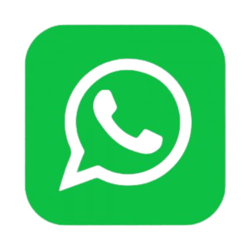

# Plano de Comunicação

<!-- topicos com numerações -->
## 1. Introdução
Este documento possui a finalidade de informar e relatar ao leitor, como foi organizada  e estruturada a comunicação da equipe de desenvolvimento, e das reuniões feitas com o product owner da DSTI, e o professor responsável pelo projeto.

## 2. Comunicação

### 2.1. Ferramentas

|**Logo**|**Nome**|**Descrição**|
|--------|-------------|---------|
||Discord|Ferramenta utilizada para comunicação rápida entre a equipe e pareamentos|
||Microsoft Teams| Ferramenta utilizada para as reuniões de equipe e com o product owner|
||WhatsApp| Ferramenta para comunicação rápida usada pela equipe|
||Google Drive| Ferramenta para gerenciar arquivos de planejamneto|
||Github| Repositório com os documentos e arquivos relacionados ao projeto|
||ZenHub| Ferramenta para acompanhamento do projeto|

### 2.2. Comunicação Interna
Comunicação interna é referente a equipe de gerência e envolvidos diretamente com o projeto

<!--frequencia semanal ou diaria, meio a maioria é remoto-->
|**Objetivo**|**Envolvidos**|**Frequencia**|**Horário**|**Meio**|
|------------|--------------|--------------|-----------|--------|
|Planejamento semanal| EPS e MDS| Segunda-feira| 20:00 ás 21:00| Remoto|
|Reunião com o product owner| EPS/MDS| Quarta-feira| 20:00 ás 21:00| Remoto|
|Acompanhamento| EPS e MDS| Quinta-feira| 20:00 ás 21:00| Remoto|

**OBS**: Reuniões com o product owner e acompanhamentos, podem ser realizados sob demanda conforme a necessidade.

### 2.3. Comunicação Externa

<!--externa é o cliente e o professor-->
|**Envolvidos**|**Comunicação**|
|--------|-------------|
|Responsáveis da DSTI| Via Microsoft Teams e Discord|
|Professor Hilmer| Via Microsoft Teams, Discord e presencialmente sob demanda|

## 4. Histórico da revisão

<!-- Aqui deve ter o Histórico da revisão com data, descrição e autores-->
|**Data**|**Descrição**|**Autor(es)**|
|--------|-------------|-------------|
|18/07/2022| Criação do plano de comunicação| Wildemberg Sales|
