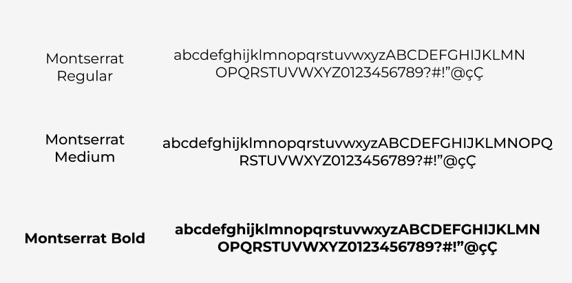

# Guia de estilo

## 1. Introdução
Se trata de um documento de registro das diretrizes de design para um produto.
Tem como principal objetivo ser uma fonte da verdade e para documentar todas as definições de design comuns a todos os projetos.
## 2. Estrutura dos templates
### 2.1 Tipografia
A principal família tipográfica definida para o projeto é a Montserrat e suas variações de estilo.

### 2.2 Cores
#### Principais
<!-- Inserir imagem -->
Original (#1F3541)
Original (#F6F6F6)
Original (#D9D9D9)
#### Secundárias
<!-- Inserir imagem -->
Original (#5289B5)
Original (#000000)
Original (#FF0000)
### 2.3 Ícones

## 3. Referências Bibliográficas
> [1] Style Guide. Disponivel em: https://aelaschool.com/designvisual/style-guide-como-desenvolver-o-guia-de-estilo-da-sua-interface/

## 4. Histórico da revisão

|**Data**|**Descrição**|**Autor(es)**|
|--------|-------------|-------------|
|20/07/2022|Criação do documento| Igor, João Soares e Pedro Siqueira|