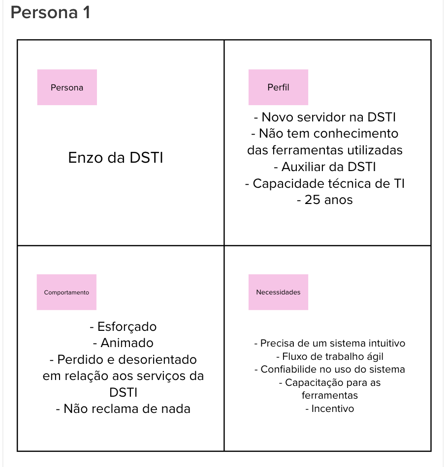
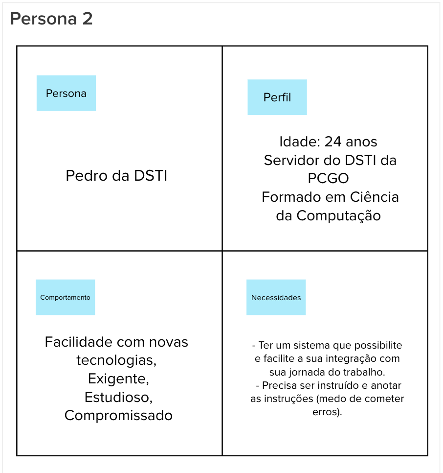
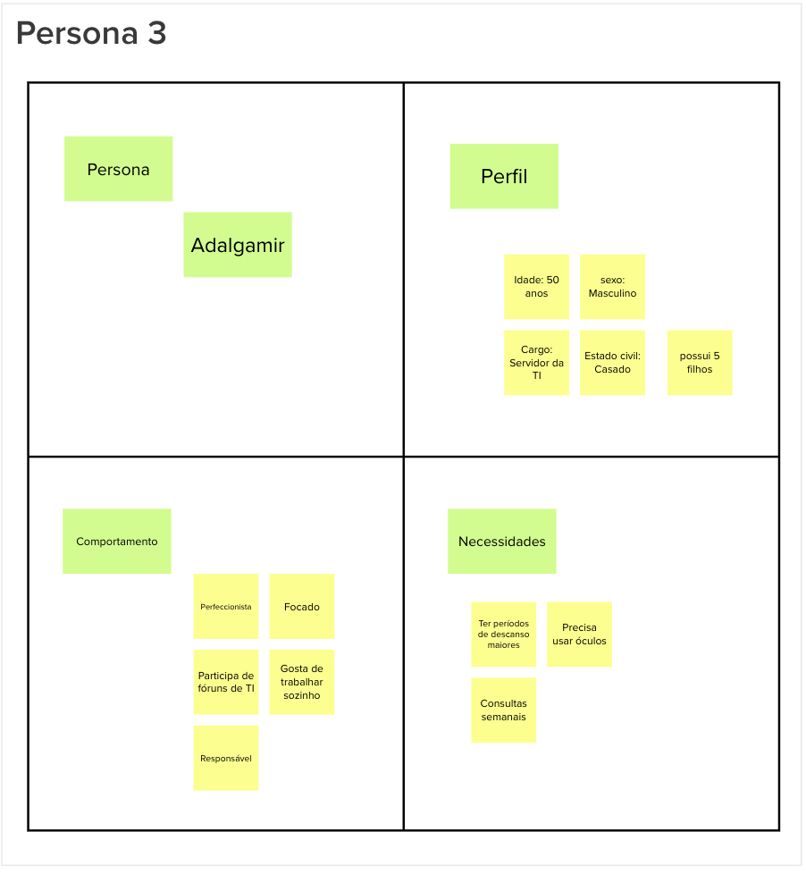

# Personas
## 1.Introdução
Persona se trata da representação fictícia do cliente ideal de um negócio. Tem como objetivo facilitar a criação de um produto, maximizar as vendas e a aceitação por parte do cliente, pois se baseia nas vontades do mesmo durante o seu desenvolvimento. Tal levantamento e análise ocorreram durante o lean inception, com presença de todos os membros da equipe.
## 2.Como definir?
Ao levantar dados sobre o comportamento e características demográficas e financeiras dos clientes, assim como histórias, motivações, objetivos etc, é possível realizar o estudo que visa maximizar a eficiência e alcance de um produto, ao alinhá-lo com as dores de seu público-alvo. 
## 3.Personas identificadas 
Através do lean inception e em reunião, juntamente com outras vias de estudo paralelo, o grupo levantou as seguintes personas.
### Persona 1
Persona:
- Enzo da DSTI. 

Perfil: 
- Novo servidor na DSTI;
- Não tem conhecimento das ferramentas utilizadas;
- Auxiliar da DSTI;
- Capacidade técnica de TI;
- 25 anos.

Comportamento: 
- Esforçado;
- Animado; 
- Perdido e desorientado em relação aos serviços da DSTI;
- Nào reclama de nada.

Necessidades: 
- Precisa de um sistema intuitivo;
- Fluxo de trabalho ágil;
- Confiabilidade no uso do sistema;
- Capacitação para as ferramentas;
- Incentivo.

### Persona 2
Persona:
- Pedro da DSTI. 

Perfil: 
- Servidor do DSTI da PCGO;
- Formado em Ciência da Computação;
- 24 anos.

Comportamento: 
- Facilidade com novas tecnologias;
- Exigente; 
- Estudioso;
- Compromissado.

Necessidades: 
- Ter um sistema que possibilite e facilite a sua integração com sua jornada do trabalho;
- Precisa ser instruído e anotar as instruções(medo de cometer erros).

### Persona 3
Persona:
- Adalgamir. 

Perfil: 
- Servidor da TI;
- Casado;
- Possui 5 filhos;
- 50 anos.

Comportamento: 
- Perfeccionista;
- Focado; 
- Participa de fóruns de TI;
- Gosta de trabalhar sozinho;
- Responsável.

Necessidades: 
- Ter períodos de descanso maiores;
- Precisa usar óculos;
- Consultas semanais.

## 4.Referências Bibliográficas
> [1] Personas. Disponivel em: https://rockcontent.com/br/blog/personas/
> [2] Lean Inception. Disponivel em: https://caroli.org/lean-inception/

## Histórico da revisão 

| Data | Versão | Descrição | Autor(es)|
|------------|-----------|------|--------|
|18/07/2022|0.1|Criação do documento e dos tópicos 1, 2 e 3|Pedro Siqueira|
|21/07/2022|0.2|Adaptando ao padrão de documentação|Pedro Siqueira|
|26/07/2022|0.3|Aplicação de sugestões vindas de feedbacks|Pedro Siqueira|
