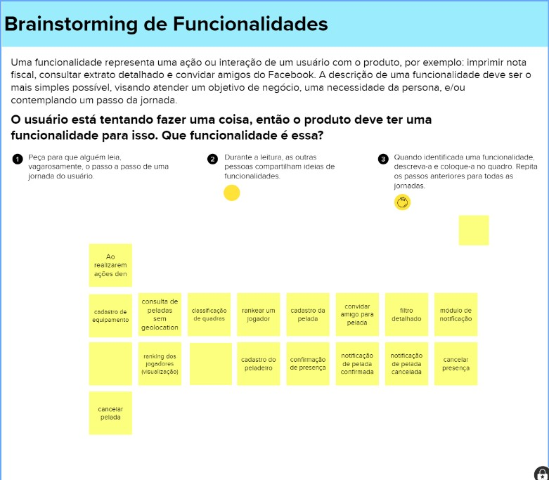
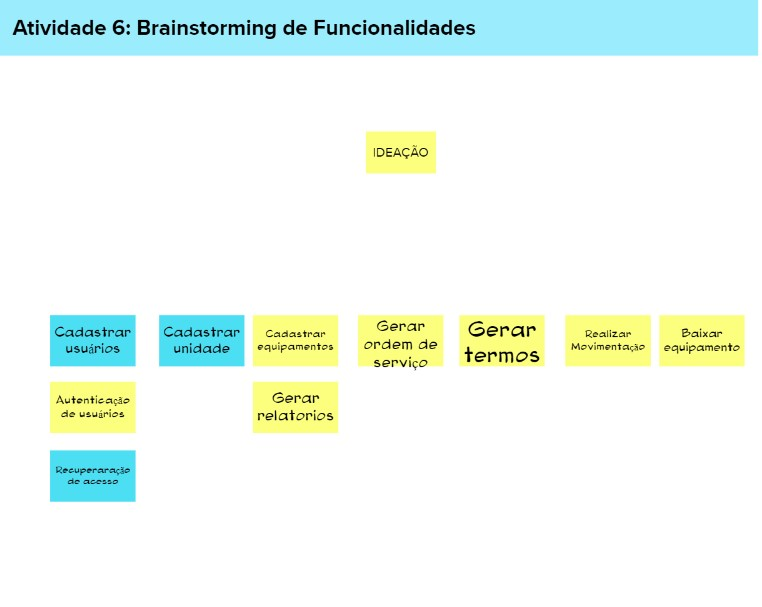

# Brainstorm de Funcionalidades

## 1. Introdução

De acordo como o autor Paulo Caroli, uma funcionalidade é a descrição de uma ação ou interação de um usuário com o produto. Tal descrição deve ser a mais simples e necessita das etapas anteriores de objetivos do produto, personas e jornadas do usuário já definidas.

Desse modo, o que buscamos com o brainstorming de funcionalidades é identificar, de acordo com as personas estabelecidas, as funcionalidades que satisfazem as necessidades da persona e os objetivos do produto. Para isso, reunimos a equipe e realizamos debates de acordo com as jornadas de usuários definidas previamente. De acordo com a leitura do passo a passo de cada uma das jornadas, após intenso debate, identificamos funcionalidades que julgamos necessárias para atender as necessidades de cada persona e os objetivos do produto.

As funcionalidades identificadas foram: cadastrar usuário, cadastrar unidade, cadastrar equipamentos, gerar ordem de serviço, gerar termos, realizar movimentação, baixar equipamentos, autenticação de usuários, gerar relatórios e recuperação de acesso. 

## 2. Planejamento/Execução

 Para a execução do brainstorm de funcionalidades, por baseado nas história de usuário, que seria alguns exemplos de como a aplicação seria utilizada uma vez que estivesse pronta. Com as informações de requisitos geradas através das histórias de usuário, foi possível gerar várias funcionalidades que nós acreditamos que seriam úteis para a aplicação como um todo.
Após ser realizado esse brainstorm mais geral, foi examinado a real necessidade de cada um desse e sua importância em relação ao funcionamento da aplicação como um todo, e após isso, foi feito um filtro das funcionalidades vitais para que a aplicação conseguisse contemplar as necessidades do usuário, com base no tempo disponível para o desenvolvimento dela.

## 3. Referências Bibliográficas

> [1] Lean Inception, visão do produto. Disponivel em: [https://www.caroli.org/atividade-escrevendo-colaborativamente-a-visao-do-produto/](https://www.caroli.org/lean-inception-saiba-como-alinhar-pessoas-e-construir-o-produto-certo/)

## 4. Histórico de revisões

|**Data**|**Descrição**|**Autor(es)**|
|--------|-------------|-------------|
|17/07/2022| iniciando doc brainstorm | Mário Vinícius |
|17/07/2022| Planejamento/Execução| João Pedro Alves Machado |
|31/07/2022| Padronizado arquivo e adicionado referência | Lucas Alexandre |

