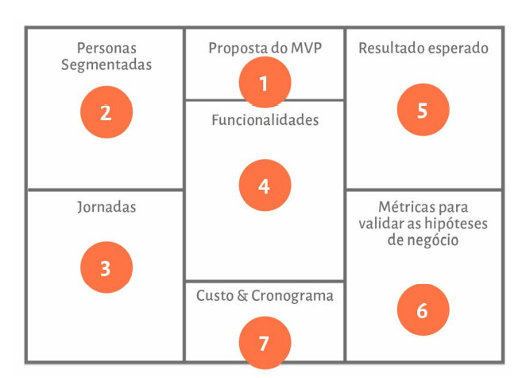
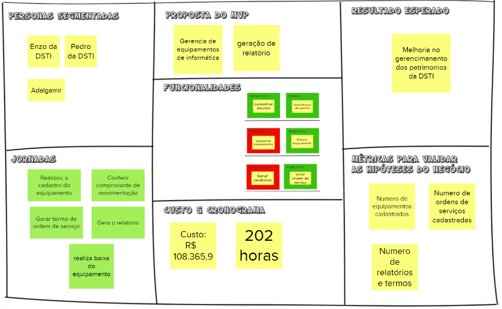

# Canvas MVP

## 1. Introdução
O Canvas MVP, segundo Paulo Caroli, é o ápse da Lean Inception. Detalhes sobre o MVP indealizado e suas funcionalidades são apresentados. 

## 2. Preenchendo o Cavas MVP
Após a definição do MVP, utilizamos um quadro para apresentar tudo o que foi idealizado(canvas MVP). Esse quadro é dividido em 7 partes, sendo cada parte responsável por conter informações como: Proposta do MVP, Personas, Jornadas, Funcionalidades, Resultado esperado, Metricas para validar as hipéteses do negócio e Custo e Cronograma.

### 2.1 Exemplo de quadro:

## 3 Canvas gerado

Seguindo as recomendações para a construção do canvas, a equipe se reuniu, utilizando os artefatos gerados nas atividades anteriores ao canvas. Com isso, foi possivel gerar o quadro, abaixo:

### 3.1 Proposta MVP
- Gerencia de equipamentos de informática.
- geração de relatório.

### 3.2 Personas
- Enzo da DSTI
- Pedro da DSTI
- Adalgamir

### 3.3 Jornadas
- Realizar o cadastro do equipamento
- Conferir comprovante de movimentação
- Gerar termo de ordem de serviço
- Gera o relatório
- Realizar baixa do equipamento

### 3.4 Funcionalidades
- Cadastrar usuários
- Autenticação de usuários
- Cadastrar equipamentos
- Baixar equipamento
- Gerar relatorios
- Criar ordem de serviço

### 3.5 Resultado esperado
- Melhoria no gerencimanento dos patrimonios da DSTI

### 3.6 Metricas
- Numero de equipamentos cadastrados
- Numero de ordens de serviços cadastradas
- Numero de relatórios e termos

### 3.7 Custo e tempo
- Custo R$ 180.365,9
- Tempo 202 horas

Mais detalhes sobre as atividades, que serviram de base para a construção deste canvas, está disponível em: [Lean Inception](https://fga-eps-mds.github.io/2022-1-Alectrion-DOC/documentation/Lean%20Inception/)

## 3. Referências Bibliográficas

> [1] Lean Inception, visão do produto. Disponivel em: [https://www.caroli.org/atividade-escrevendo-colaborativamente-a-visao-do-produto/](https://www.caroli.org/lean-inception-saiba-como-alinhar-pessoas-e-construir-o-produto-certo/)
## 4. Histórico da revisão

|**Data**|**Descrição**|**Autor(es)**|
|--------|-------------|-------------|
|31/07/2022|Criação do documento| Moacir Mascarenha|
