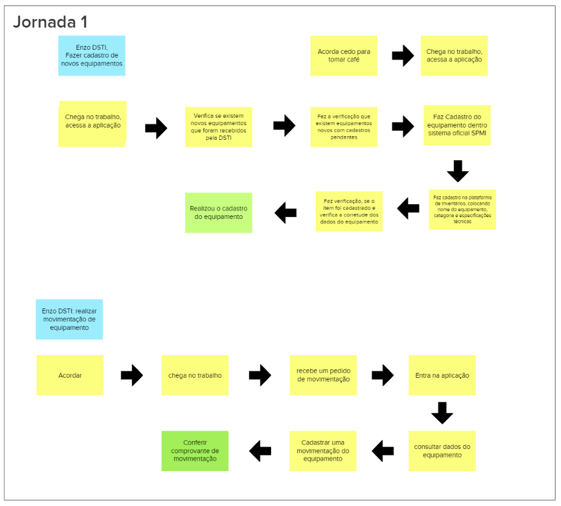
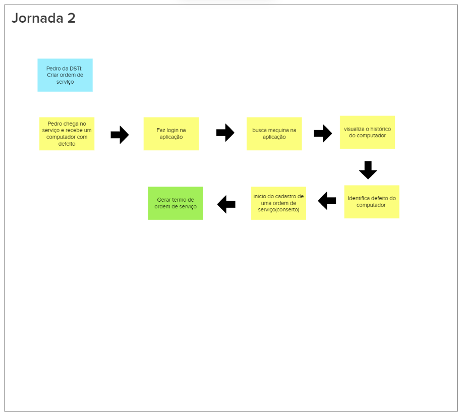
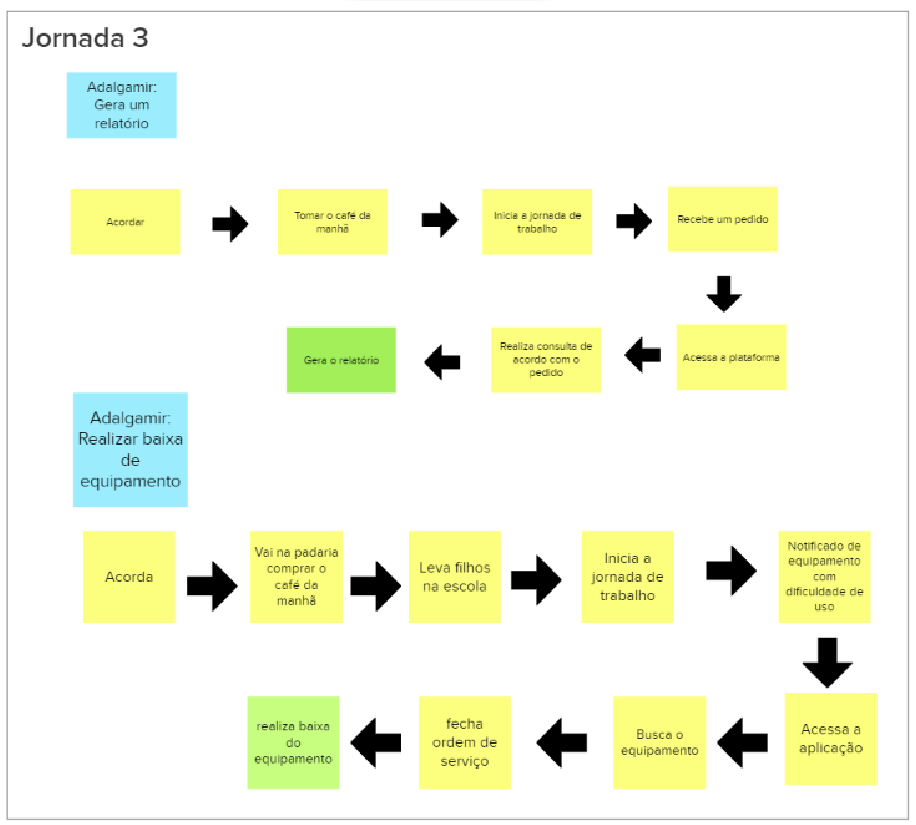

# Jornada de Usuário

## 1. Introdução

Essa etapa tem uma o objetivo de representar visualmente as etapas do relacionamento do cliente com o produto. Ou seja, é imaginado um cenario( jornada), onde o usuário realiza ações, passando por todo o processo de uso do serviço/produto. Podendo assim mapear todos os pontos de contato do usuario e montar uma historia onde ele é o protagonista.

## 2. Processo de Criação das jornadas

Para está atividade o grupo se reuniu e se separaram em grupos, cada um com a funcionalidade de criar uma jornada de usuario detalhando a historia do cliente, desde a chegada do serviço, até o final da ação principal. Desta forma o grupo definiu as seguintes jornadas:

### 2.1 Jornada 1

### 2.2 Jornada 2

### 2.3 Jornada 3

## 3. Referências Bibliográficas

> [1] Lean Inception, mapeamento de história de usuário. Disponivel em: https://www.caroli.org/usm-e-direto-ao-ponto/

> [2] Lean Inception, fazendo uma user story. Disponivel em: https://www.caroli.org/estoria-do-usuario-uma-visao-holistica/

## 4. Histórico da revisão

|**Data**|**Descrição**|**Autor(es)**|
|--------|-------------|-------------|
|31/07/2022|Criação e Finalização do documento| Lucas Heler Lopes|