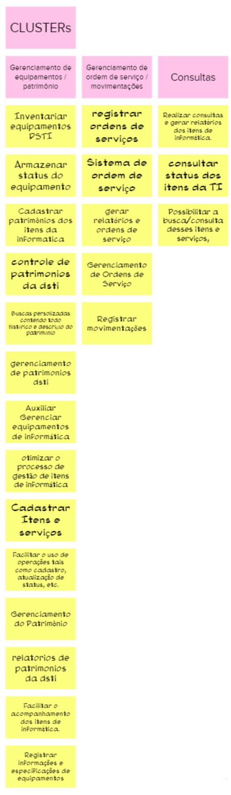

# Objetivos do Produto

## 1. Introdução

Por que esse produto é necessário?, que necessidade ele atende? Essas são perguntas comuns que podem ser feitas ao início de um projeto. Para isso, a etapa Objetivos do produto do Lean inception serve para ajudar a localização dos objetivos a serem alcançados durante o projeto respondendo perguntas como o por que do produto ser necessário e qual as necessidades que ele atende.

## 2. Método

Durante o projeto, foi feita uma reunião onde a equipe tinha o objetivo de resumir o produto em três objetivos que cada integrante pensasse. Depois disso era solicitado que os participantes compartilhassem o que foi escrito agrupando em 'Clusters'.

No final, o resultado foram esses:

## 3. Referências Bibliográficas

> [1] Lean Inception,Objetivos do produto. Disponivel em: https://www.caroli.org/objetivos-produto-negocio-usuario/

## 4. Histórico da revisão

|**Data**|**Descrição**|**Autor(es)**|
|--------|-------------|-------------|
|22/07/2022|Criação do documento| Lucas Heler Lopes|
