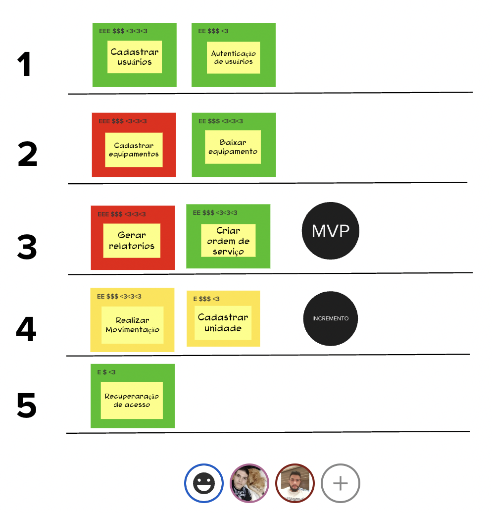

# Sequenciador

## 1. Introdução

O sequenciador é uma ferramenta visual, de fácil entendimento e bastante eficaz para que as pessoas compreendam, organizem e priorizem melhor os seus itens de trabalho.

Passo a passo do sequenciador:

1. Escreva cada item de trabalho em um post-it.
2. Identifique o nível de confiança: O QUE versus COMO.
3. Converse sobre valor e esforço relativo.
4 .Coloque em ordem.

Essas são as seis regras para adicionar cartões às ondas. Tais regras foram definidas depois de aplicar esta forma de organização e priorização de itens de trabalho inúmeras vezes.

- Regra 1: Uma onda pode conter, no máximo, três cartões.
- Regra 2: Uma onda não pode conter mais de um cartão vermelho.
- Regra 3: Uma onda não pode conter três cartões amarelos e vermelhos.
- Regra 4: A soma de esforço dos cartões não pode ultrapassar cinco Es.
- Regra 5: A soma de valor dos cartões de uma onda não pode ser menos de quatro $s e quatro corações.
- Regra 6: Se um cartão depende de outro cartão, esse outro deve estar em alguma onda anterior.

## 2. Sequenciador

Para esta atividade o grupo se reuniu e cada um dos membros avaliou o nível de confiança para cada item, após a avaliação individual, foi realizada uma discussão para identificar o valor e o esforço relativo, após as definições os cartões foram priozados em suas respectivas ondas e de acordo com as regras do sequenciador e enviado para validação com o PO, Guilherme Pupack, que solicitou mudanças na prioridade de alguns cartões.

## 3. Referências Bibliográficas

> [Sequenciador] Como Ordenar e Priorizar. Disponivel em: https://www.caroli.org/sequenciador/

## 4. Histórico da revisão

| **Data**   | **Descrição**        | **Autor(es)** |
| ---------- | -------------------- | ------------- |
| 31/07/2022 | Criação do documento, Correção da imagem do sequenciador | Matheus Estanislau, Igor Silva   |
