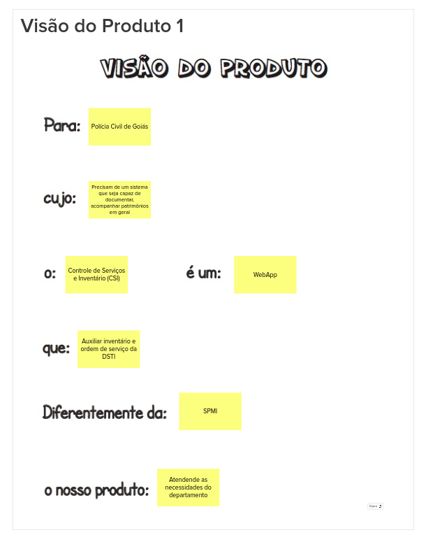
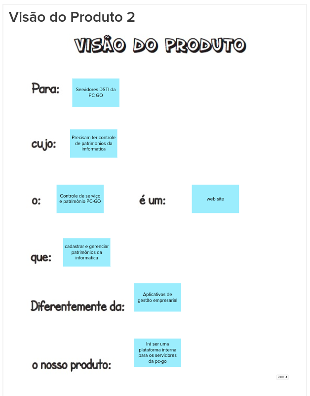
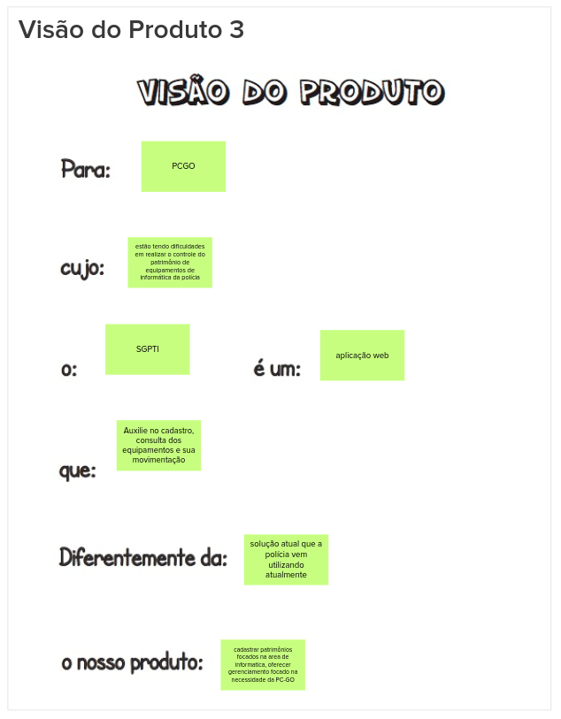

# Visão do produto

## 1. Introdução

Esta etapa do Lean Inception serve como um caminho inicial para a definição do produto, onde é definido uma visão geral sobre sobre o produto e reflexão sobre seu valor. Esta visão é feita colaborativamente entre a equipe seguindo o seguinte template:

- Para [cliente final]

- Cujo [problema que precisa ser resolvido],

- O [nome do produto]

- É um [categoria do produto]

- Que [benefício chave, razão para adquiri-lo].

- Diferentemente da [alternativa da concorrência],

- O nosso produto [diferença chave].

## 2. Visões do produto

Para está atividade o grupo se reuniu e cada um dos membros expressou sua visão do produto, para uma centralização de ideias entre a equipe. Desta forma o grupo definiu as seguintes visões:

### 2.1 Visão 1

### 2.2 Visão 2

### 2.3 Visão 3

## 3. Referências Bibliográficas

> [1] Lean Inception, visão do produto. Disponivel em: https://www.caroli.org/atividade-escrevendo-colaborativamente-a-visao-do-produto/

## 4. Histórico da revisão

|**Data**|**Descrição**|**Autor(es)**|
|--------|-------------|-------------|
|17/07/2022|Criação do documento| João Soares|
