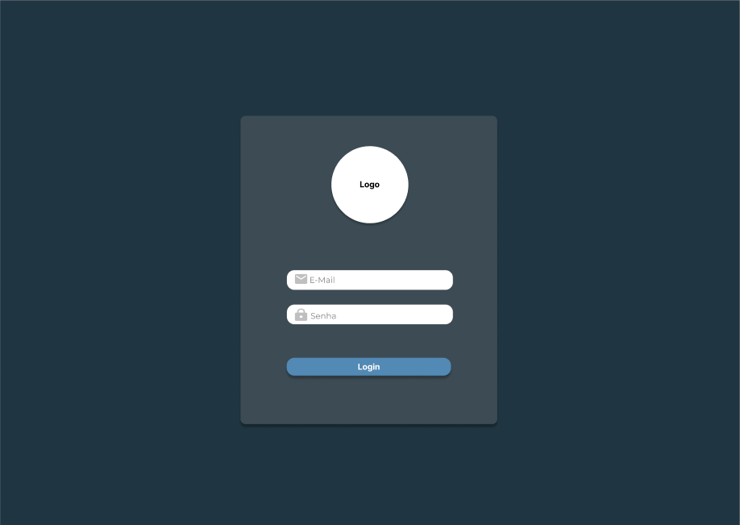
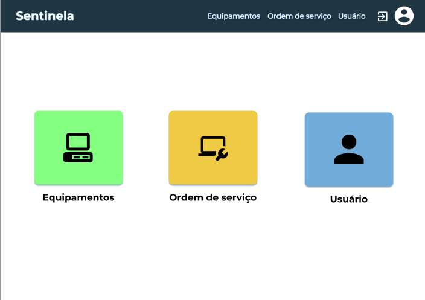
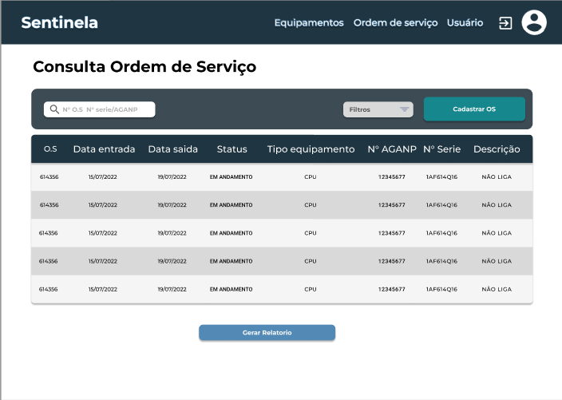
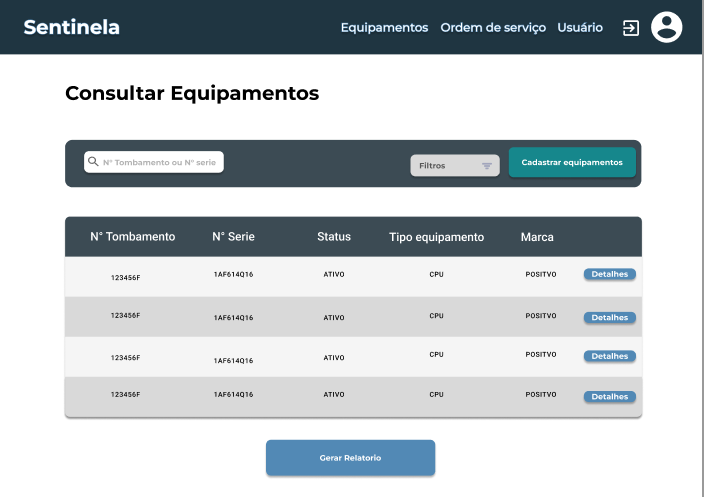

# Protótipo baixa fidelidade

 

## 1. Introdução

 

O protótipo de alta fidelidade tem como objetivo principal representar fielmente o produto, tanto em relação às funcionalidades quanto à estética e comportamento, apresentar detalhes das operações e suas extensões, como funcionalidades de botões e possíveis retornos de erros, conter as possíveis e diferentes etapas percorridas pelos usuários

 

## 2. Protótipo

 

O protótipo de alta fidelidade foi desenvolvido na ferramenta figma, apresentado e validado com o usuário. Abaixo está ilustrado algumas das principais telas do sistema.

 

### Tela Login:
-   

 

### Tela de Tarefas:
- 

 

### Tela de Ordens de Serviços abertas:
- 

 

### Tela equipamento:
- 

 

Todas as telas do protipo estão disponíveis em: 
[Figma](https://www.figma.com/file/JTsTpcNziovScbWZ1ts1q1/Alectrion?node-id=69%3A2)

## 3. Referência

 

> [1] Prototipagem de alta fidelidade: o que é, quando, por que e como usar? Disponível em: [https://www.digitalhouse.com/br/blog/prototipo-de-baixa-fidelidade/](https://medium.com/somos-tera/prototipagem-de-alta-fidelidade-635d745b662b)
>
> [2] Ferramento Figma. Disponível em: https://www.figma.com/

## 4. Histórico da revisão

|**Data**|**Descrição**|**Autor(es)**|
|--------|-------------|-------------|
|18/07/2022|Criação do documento| João Pedro Soares, Lucas Alexandre, Moacir Mascarenha, Matheus de Cristo, Mário Vinícius, Wildemberg Junior e Lucas Heler|
