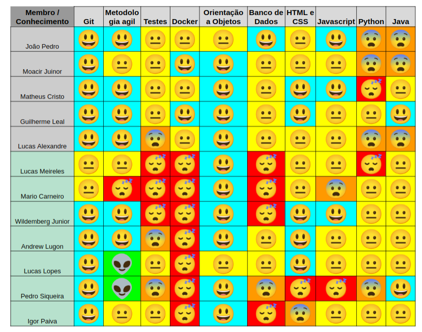

# Sprint 1

 

## 1. Visão geral

 

- Data Inicio: 25/07/2022
- Data Termino: 31/07/2022

 

## 2. Semana Backlog

 

|Tarefas|
|--------|
|EAP|
|treinamento de teste|
|configurar CI/CD|
|documentar jornada de usuário|
|doc brainstorm de funcionalidades| 
|Canvas MVP| 
|Identidade visual| 
|Protótipo de alta fidelidade|
|Ajustar documento de arquitetura| 
|issue [#88](https://github.com/fga-eps-mds/2022-1-Alectrion/issues/88)| 
|issue [#89](https://github.com/fga-eps-mds/2022-1-Alectrion/issues/89)| 
|issue [#90](https://github.com/fga-eps-mds/2022-1-Alectrion/issues/90)| 
|issue [#91](https://github.com/fga-eps-mds/2022-1-Alectrion/issues/91)| 
|issue [#92](https://github.com/fga-eps-mds/2022-1-Alectrion/issues/92)| 
|issue [#93](https://github.com/fga-eps-mds/2022-1-Alectrion/issues/93)|

## 3. Quadro de conhecimento antes do início da Semana

 

 

## 4. Reuniões

|Turma|Nome|Planning/Review|Reunião PO|
|--|--|--|--|
|EPS|Guilherme Leal|presente|presente|
|EPS|João Pedro Soares|presente|presente|
|EPS|Lucas Alexandre|presente|presente|
|EPS|Matheus Estanislau|presente|presente|
|EPS|Moacir Mascarenha|presente|presente|
|MDS|Lucas Oliveira Meireles|ausente|presente|
|MDS|Pedro Siqueira|ausente|presente|
|MDS|Andrew Oliveira Cerqueira Lugon|ausente|presente|
|MDS|Wildemberg Sales da Silva Junior|presente|presente|
|MDS|Mário Vinícius|presente|presente|
|MDS|Igor Silva de Paiva|presente|presente|
|MDS|João Pedro Alves Machado|presente|presente|
|MDS|Lucas Heler Lopes|presente|presente|

## 5. Histórico da revisão

|**Data**|**Descrição**|**Autor(es)**|
|--------|-------------|-------------|
|25/07/2022|Criação do documento| Guilherme Leal |

