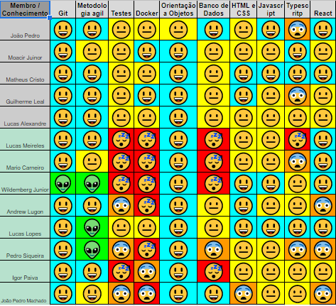

# Sprint 6 

 

## 1. Visão geral

 

- Data Inicio: 29/08/2022
- Data Termino: 05/08/2022

 

## 2. Sprint Backlog

 
Objetivo da sprint: finalizar atividades remanescentes das US2 e US05 e início das US's: 06, 07 14 e 16.

|Tarefas|
|--------|
|[US02](https://github.com/fga-eps-mds/2022-1-Alectrion-DOC/issues/61) - Lucas Heler e Mário|
|[US05](https://github.com/fga-eps-mds/2022-1-Alectrion-DOC/issues/76) - Pedro Siqueira e João Pedro|
|[US06](https://github.com/fga-eps-mds/2022-1-Alectrion-DOC/issues/78) - Wildemberg e Igor|
|[US07](https://github.com/fga-eps-mds/2022-1-Alectrion-DOC/issues/79) - (incremento)|
|[US14](https://github.com/fga-eps-mds/2022-1-Alectrion-DOC/issues/69) - Matheus e Lucas Alexandre|
|[US16](https://github.com/fga-eps-mds/2022-1-Alectrion-DOC/issues/72) - GUilherme e João Pedro|

## 3. Quadro de conhecimento antes do início da Sprint

 

 

## 4. Reuniões Semanais

|Turma|Nome|Planning/Review|Reunião PO|
|--|--|--|--|
|EPS|Guilherme Leal|:white_check_mark:|:white_check_mark:|
|EPS|João Pedro Soares|:white_check_mark:|:white_check_mark:|
|EPS|Lucas Alexandre|:white_check_mark:|:white_check_mark:|
|EPS|Matheus Estanislau|:white_check_mark:|:white_check_mark:|
|EPS|Moacir Mascarenha|:white_check_mark:|:white_check_mark:|
|MDS|Andrew Oliveira Cerqueira Lugon|:x:|:x:|
|MDS|Igor Silva de Paiva|:x:|:white_check_mark:|
|MDS|João Pedro Alves Machado|:white_check_mark:|:white_check_mark:|
|MDS|Mário Vinícius|:white_check_mark:|:white_check_mark:|
|MDS|Lucas Heler Lopes|:white_check_mark:|:white_check_mark:|
|MDS|Lucas Oliveira Meireles|:x:|:x:|
|MDS|Pedro Siqueira|:white_check_mark:|:white_check_mark:|
|MDS|Wildemberg Sales da Silva Junior|:white_check_mark:|:white_check_mark:|

## 5. Histórico da revisão

|**Data**|**Descrição**|**Autor(es)**|
|--------|-------------|-------------|
|29/08/2022|Criação do documento| Guilherme Leal |

