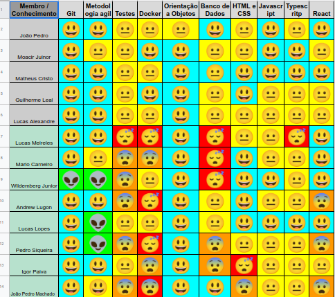

# Sprint 7

 

## 1. Visão geral

 

- Data Inicio: 05/09/2022
- Data Termino: 12/09/2022

 

## 2. Sprint Backlog

 
Objetivo da sprint: Finalizar: US05, US06, US14, US16

|Tarefas sprint 7|
|--------|
|[US05](https://github.com/fga-eps-mds/2022-1-Alectrion-DOC/issues/76) - Pedro Siqueira e João Pedro|
|[US06](https://github.com/fga-eps-mds/2022-1-Alectrion-DOC/issues/78) - Wildemberg e Igor|
|[US14](https://github.com/fga-eps-mds/2022-1-Alectrion-DOC/issues/69) - Matheus e Lucas Alexandre|
|[US16](https://github.com/fga-eps-mds/2022-1-Alectrion-DOC/issues/72) - Guilherme e João Pedro|
|[US07](https://github.com/fga-eps-mds/2022-1-Alectrion-DOC/issues/79) - (incremento)|
|[US09](https://github.com/fga-eps-mds/2022-1-alectrion-doc/issues/59) - (incremento)|
|Refatoração EVM (agile) - Guilherme|
|Ajuste coleta de métricas por PR - Moacir|

## 3. Quadro de conhecimento antes do início da Sprint

 

 

## 4. Reuniões Semanais

|Turma|Nome|Planning/Review|Reunião PO|
|--|--|--|--|
|EPS|Guilherme Leal|presente|presente|
|EPS|João Pedro Soares|presente|presente|
|EPS|Lucas Alexandre|presente|presente|
|EPS|Matheus Estanislau|presente|presente|
|EPS|Moacir Mascarenha|presente|presente|
|MDS|Igor Silva de Paiva|presente|presente|
|MDS|João Pedro Alves Machado|presente|presente|
|MDS|Mário Vinícius|presente|presente|
|MDS|Lucas Heler Lopes|presente|presente|
|MDS|Pedro Siqueira|ausente|presente|
|MDS|Wildemberg Sales da Silva Junior|presente|presente|

## 5. Histórico da revisão

|**Data**|**Descrição**|**Autor(es)**|
|--------|-------------|-------------|
|05/09/2022|Criação do documento| Guilherme Leal |

